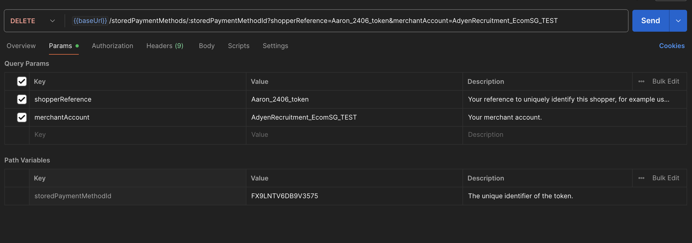
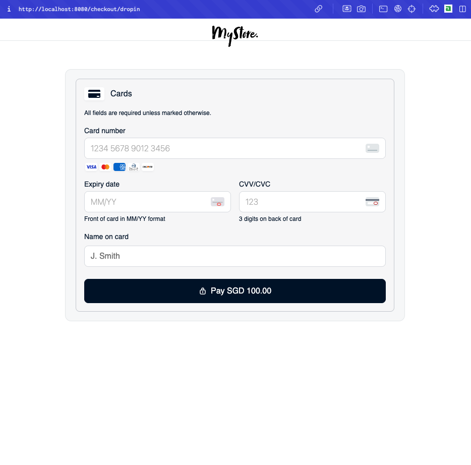
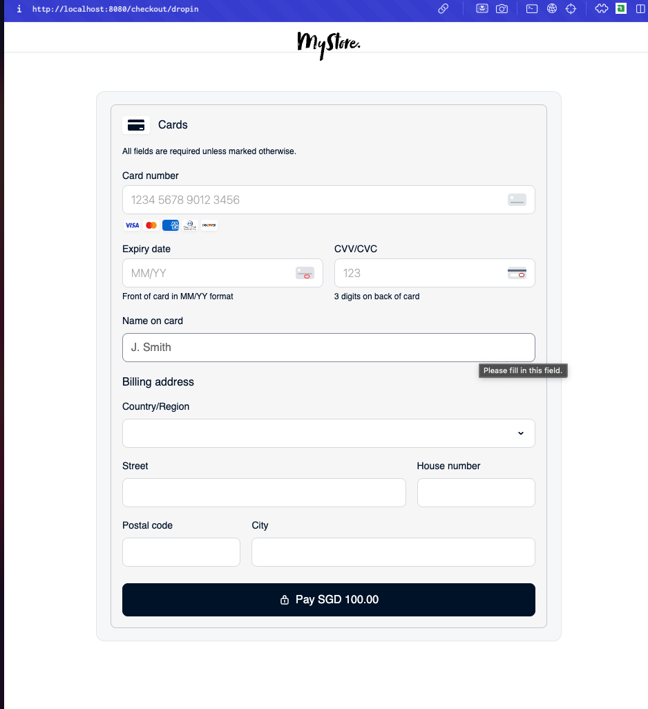
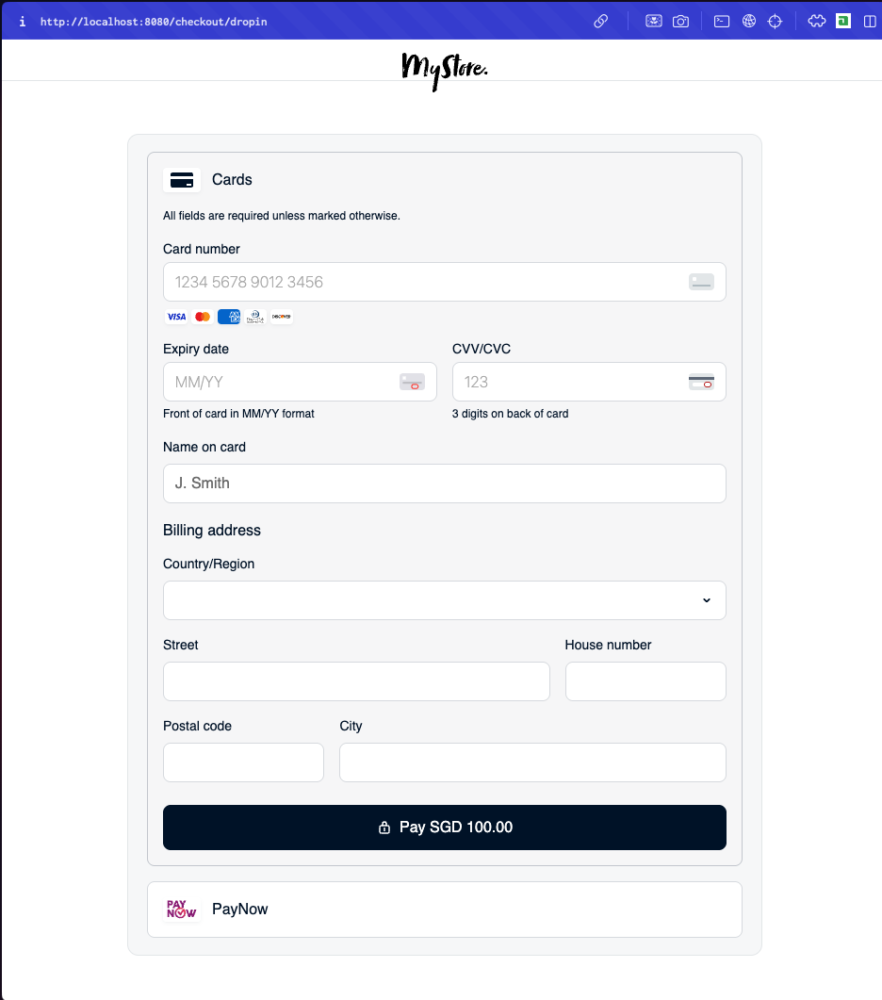
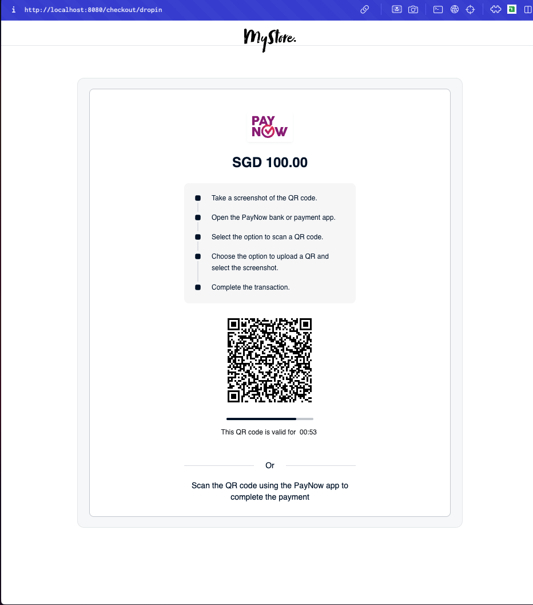

# Case Study: Expanding with ZFashion Pte. Ltd.

---

## 1. API Integration

### A. Payment Requests

#### a. On `AdyenRecruitmentCOM`

---

### **i. Mastercard Payment – SGD $60**

- **HTTP Method:** `POST`  
- **Endpoint:** `https://checkout-test.adyen.com/v71/payments`


- **Request Body:**
```json
{
 "amount": {
 "currency": "SGD",
 "value": 6000
},
 "reference": "Aaron_2306_mastercard",
 "paymentMethod": {
 "type": "scheme",
 "encryptedCardNumber": "test_5577000055770004",
 "encryptedExpiryMonth": "test_03",
 "encryptedExpiryYear": "test_2030",
 "encryptedSecurityCode": "test_737"
},
 "returnUrl": "https://docs.adyen.com/online-payments/",
 "merchantAccount": "AdyenRecruitmentCOM"
} 
```
- **Response Body:**

```json
{
    "additionalData": {...
    },
    "fraudResult": {...
    },
    "pspReference": "R2FNRN7Z2SP7ZG75",
    "resultCode": "Authorised",
    "amount": {
        "currency": "SGD",
        "value": 6000
    },
    "merchantAccount": "AdyenRecruitmentCOM",
    "merchantReference": "Aaron_2306_mastercard",
    "paymentMethod": {
        "brand": "mc",
        "type": "scheme"
    }
}
```
### **ii. Visa Payment – SGD $80**

- **HTTP Method:** `POST`  
- **Endpoint:** `https://checkout-test.adyen.com/v71/payments`

- **Request Body:**
```json
{
 "amount": {
 "currency": "SGD",
 "value": 8000
},
 "reference": "Aaron_2306_visa",
 "paymentMethod": {
 "type": "scheme",
 "encryptedCardNumber": "test_4111111111111111",
 "encryptedExpiryMonth": "test_03",
 "encryptedExpiryYear": "test_2030",
 "encryptedSecurityCode": "test_737"
},
 "returnUrl": "https://docs.adyen.com/online-payments/",
 "merchantAccount": "AdyenRecruitmentCOM"
}
```
- **Response Body:**

```json
{
    "additionalData": {...
    },
    "fraudResult": {...
    },
    "pspReference": "JQG6TBPBQZ9TPM75",
    "resultCode": "Authorised",
    "amount": {
        "currency": "SGD",
        "value": 8000
    },
    "merchantAccount": "AdyenRecruitmentCOM",
    "merchantReference": "Aaron_2306_visa",
    "paymentMethod": {
        "brand": "visa",
        "type": "scheme"
    }
}
```
---
#### b. On `AdyenRecruitment_EcomSG_TEST`

---
### **i. Amex Payment – SGD $100**

- **HTTP Method:** `POST`  
- **Endpoint:** `https://checkout-test.adyen.com/v71/payments`


- **Request Body:**
```json
{
 "amount": {
 "currency": "SGD",
 "value": 10000
},
 "reference": "Aaron_2306_amex",
 "paymentMethod": {
 "type": "scheme",
 "encryptedCardNumber": "test_370000000000002",
 "encryptedExpiryMonth": "test_03",
 "encryptedExpiryYear": "test_2030",
 "encryptedSecurityCode": "test_7373"
},
 "returnUrl": "https://docs.adyen.com/online-payments/",
 "merchantAccount": "AdyenRecruitment_EcomSG_TEST"
} 
```
- **Response Body:**

```json
{
    "additionalData": {...
    },
    "fraudResult": {...
    },
    "pspReference": "WHNMD8HQV67FHJ75",
    "resultCode": "Authorised",
    "amount": {
        "currency": "SGD",
        "value": 10000
    },
    "merchantAccount": "AdyenRecruitment_EcomSG_TEST",
    "merchantReference": "Aaron_2306_amex",
    "paymentMethod": {
        "brand": "amex",
        "type": "scheme"
    }
}
```
---
### B. Mastercard $60 payment full capture request

- **HTTP Method:** `POST`

- **Endpoint:** 
`https://checkout-test.adyen.com/v71/payments/{paymentPspReference}/captures`  

paymentPspReference used here will belong to the mastercard $60 payment earlier which is `R2FNRN7Z2SP7ZG75`.


- **Request Body:**
```json
{
    "merchantAccount": "AdyenRecruitmentCOM",
    "amount": {
        "value": 6000,
        "currency": "SGD"
    }
}
```
- **Response Body:**

```json
{
    "merchantAccount": "AdyenRecruitmentCOM",
    "paymentPspReference": "R2FNRN7Z2SP7ZG75",
    "pspReference": "BZLL99SX3QGTPM75",
    "status": "received",
    "amount": {
        "currency": "SGD",
        "value": 6000
    }
}
```
---
### C. Visa cancellation request 

- **HTTP Method:** `POST`

- **Endpoint:** 
`https://checkout-test.adyen.com/v71/payments/{paymentPspReference}/cancelss` 

paymentPspReference used here will belong to the Visa $80 payment earlier which is `JQG6TBPBQZ9TPM75`.


- **Request Body:**
```json
{
    "paymentReference": "JQG6TBPBQZ9TPM75",
    "reference": "Aaron_2306_visa_cancellation",
    "merchantAccount": "AdyenRecruitmentCOM"
}
```
- **Response Body:**

```json
{
    "merchantAccount": "AdyenRecruitmentCOM",
    "pspReference": "SVFSL29CP3K7ZG75",
    "reference": "Aaron_2306_visa_cancellation",
    "status": "received",
    "paymentReference": "JQG6TBPBQZ9TPM75"
}
```
---
### D. REFUND webhook notifications
**Assumptions:** From observation, I think that the payments made have delayed automatic capture. Reasoning behind that being that Amex payment could be succesfully refunded even though no manual capture request was done on it. 

Without a capture delay, the Visa cancellation request would have been likely failed because the payment request would have been immediately captured after authorization and then the payment should be able to be refunded after when requested, instead of failing.

| Transaction        | Notification                                              | Reason |
|--------------------|------------------------------------------------------------|--------|
| Mastercard Payment | `"reason" : "", "success" : "true"`                        | The Mastercard payment request previously made was succesful and it was authorized and then captured after some delay so the refund request worked.      |
| Visa Payment       | `"reason" : "Transaction hasn't been captured, refund not possible", "success" : "false"` | The Visa payment request previously made was sucessful so it was authorized but not captured yet. Before it can be captured, there was a cancellation request made on that request. Refund on that request will not be possible since it was never captured in the first place.    |
| Amex Payment       | `"reason" : "", "success" : "true"`                        | The Amex payment request previously made was succesful and it was authorized and then captured after some delay so the refund request worked.    |
---
### E. Tokenisation with AdyenRecruitment_EcomSG_TEST
---

### a. Creation of One-off token with zero auth transaction
- **HTTP Method:** `POST`  
- **Endpoint:** `https://checkout-test.adyen.com/v71/payments`


- **Request Body:**
```json
{
    "amount": {
        "currency": "SGD",
        "value": 0
    },
    "reference": "Your order number",
    "paymentMethod": {
        "type": "scheme",
        "encryptedCardNumber": "test_4111111111111111",
        "encryptedExpiryMonth": "test_03",
        "encryptedExpiryYear": "test_2030",
        "encryptedSecurityCode": "test_737"
    },
    "shopperReference": "Aaron_2406_token",
    "storePaymentMethod": true, //set to true here to store 
    "shopperInteraction": "Ecommerce",
    "recurringProcessingModel": "CardOnFile",
    "returnUrl": "https://docs.adyen.com/online-payments/",
    "merchantAccount": "AdyenRecruitment_EcomSG_TEST"
}
```
- **Response Body:**

```json
{
    "additionalData": {
        "tokenization.storedPaymentMethodId": "FX9LNTV6DB9V3575",
        "tokenization.store.operationType": "created",
        "tokenization.shopperReference": "Aaron_2406_token",
        ...
    },
    "fraudResult": {...
    },
    "pspReference": "W6H346NQV67FHJ75",
    "resultCode": "Authorised",
    "amount": {
        "currency": "SGD",
        "value": 0
    },
    "merchantAccount": "AdyenRecruitment_EcomSG_TEST",
    "merchantReference": "Your order number",
    "paymentMethod": {
        "brand": "visa",
        "type": "scheme"
    }
}
```
---

### One-off SGD$88 payment request with created token

- **HTTP Method:** `POST`  
- **Endpoint:** `https://checkout-test.adyen.com/v71/payments`

Token previously created is `FX9LNTV6DB9V3575`.

- **Request Body:**
```json
{
    "amount": {
        "currency": "SGD",
        "value": 8800
    },
    "reference": "Your order number",
    "paymentMethod": {
        "type": "scheme",
        "storedPaymentMethodId": "FX9LNTV6DB9V3575",
        "encryptedSecurityCode": "test_737"
    },
    "shopperReference": "Aaron_2406_token",
    "returnUrl": "https://docs.adyen.com/online-payments/",
    "merchantAccount": "AdyenRecruitment_EcomSG_TEST",
    "shopperInteraction": "ContAuth",
    "recurringProcessingModel": "CardOnFile"
}
```
- **Response Body:**

```json
{
    "additionalData": {
        "scaExemptionRequested": "transactionRiskAnalysis",
        "refusalReasonRaw": "AUTHORISED",
        "eci": "N/A",
        "acquirerAccountCode": "TestPmmAcquirerAccount",
        "xid": "N/A",
        "recurring.contractTypes": "ONECLICK,RECURRING",
        "recurring.recurringDetailReference": "FX9LNTV6DB9V3575",
        "recurringProcessingModel": "CardOnFile",
        "threeDAuthenticated": "false",
        "paymentMethodVariant": "visa",
        "issuerBin": "41111111",
        "payoutEligible": "Y",
        "fraudManualReview": "false",
        "threeDOffered": "false",
        "threeDOfferedResponse": "N/A",
        "authorisationMid": "50",
        "recurring.firstPspReference": "W6H346NQV67FHJ75",
        "tokenization.storedPaymentMethodId": "FX9LNTV6DB9V3575",
        "cavv": "N/A",
        "fundsAvailability": "I",
        "authorisedAmountCurrency": "SGD",
        "threeDAuthenticatedResponse": "N/A",
        "avsResultRaw": "5",
        "retry.attempt1.rawResponse": "AUTHORISED",
        "paymentMethod": "visa",
        "recurring.shopperReference": "Aaron_2406_token",
        "retry.attempt1.scaExemptionRequested": "transactionRiskAnalysis",
        "avsResult": "5 No AVS data provided",
        "cardSummary": "1111",
        "retry.attempt1.avsResultRaw": "5",
        "networkTxReference": "705462025680611",
        "expiryDate": "3/2030",
        "cavvAlgorithm": "N/A",
        "cardBin": "411111",
        "cvcResultRaw": "M",
        "merchantReference": "Your order number",
        "acquirerReference": "DBBDPL75PB8",
        "cardIssuingCountry": "NL",
        "liabilityShift": "false",
        "fraudResultType": "GREEN",
        "authCode": "093131",
        "cardHolderName": "Checkout Shopper PlaceHolder",
        "isCardCommercial": "unknown",
        "PaymentAccountReference": "3hLjMFxeTybT3By27MUraPo1Z1o9H",
        "retry.attempt1.acquirerAccount": "TestPmmAcquirerAccount",
        "cardIssuingBank": "ADYEN TEST BANK",
        "retry.attempt1.acquirer": "TestPmmAcquirer",
        "tokenization.shopperReference": "Aaron_2406_token",
        "authorisedAmountValue": "8800",
        "issuerCountry": "NL",
        "cvcResult": "1 Matches",
        "retry.attempt1.responseCode": "Approved",
        "retry.attempt1.shopperInteraction": "ContAuth",
        "cardPaymentMethod": "visa",
        "acquirerCode": "TestPmmAcquirer"
    },
    "fraudResult": {
        "accountScore": 0,
        "results": [
            {
                "accountScore": 0,
                "checkId": 1,
                "name": "PaymentDetailRefCheck"
            },
            {
                "accountScore": 0,
                "checkId": 41,
                "name": "PaymentDetailNonFraudRefCheck"
            },
            {
                "accountScore": 0,
                "checkId": 13,
                "name": "IssuerRefCheck"
            },
            {
                "accountScore": 0,
                "checkId": 15,
                "name": "IssuingCountryReferral"
            }
        ]
    },
    "pspReference": "TZJC2DMXGJ522P75",
    "resultCode": "Authorised",
    "amount": {
        "currency": "SGD",
        "value": 8800
    },
    "merchantAccount": "AdyenRecruitment_EcomSG_TEST",
    "merchantReference": "Your order number",
    "paymentMethod": {
        "brand": "visa",
        "type": "scheme"
    }
}
```
---
### **c. Deleting the one-off token created**

- **HTTP Method:** `DELETE`  
- **Endpoint:** `https://checkout-test.adyen.com/v71/storedPaymentMethods/:storedPaymentMethodId?shopperReference=Aaron_2406_token&merchantAccount=AdyenRecruitment_EcomSG_TEST`

where path variable `storedPaymentMethodId` is `FX9LNTV6DB9V3575`


- **Request Body:**
```json
No request body, everything is in the query params and path variable. as shown in the screenshot below.
```


- **Response Body:**

```json
No request body after successful deletion, just a HTTP 204 Code received. However, I verified the token was indeed deleted because I tried making another payment request with the deleted token but it did not work.
```
---
### d. Issue with duplicated tokens
## Steps to Check for Duplicate Tokens Across ShopperReferences

1. **Collect ShopperReferences**  
   - Gather all shopperReference values used when storing payment method.

2. **List Stored Tokens per ShopperReference**  
   - For each shopperReference, call Adyen’s `POST /storedPaymentMethods` API to retrieve their saved cards. The api call can be found in `https://www.postman.com/adyendev/adyen-apis/request/eo7xycz/adyen-checkout-api-v71?action=share&creator=27884467&ctx=documentation`

3. **Extract Card Fingerprints**  
   - For each token, record key details: `brand`, `lastFour`, and `expiryMonth/expiryYear`. These four fields will help to identify a unique stored payment method and act as the card's "fingerprint".

4. **Compare Across ShopperReferences**  
   - Group tokens by these fingerprints. If the same card appears under multiple shopperReferences, it's a duplicate.

For example if you run this request for:

ZFashion_mc1 → also sees Visa ending in 1111, expires 03/30

ZFashion_mc2 → also sees Visa ending in 1111, expires 03/30

Then you can say: “This card has been stored under multiple shopperReferences — it's a duplicate.”


---
### 2. Adyen's PSP Role

```
Subject: Clarifying Adyen’s Role as PSP & Acquiring for ZFashion

Hi Zeta,

Thank you for reaching out. I’m happy to clarify how Adyen serves as your Payment Service Provider (PSP) and handles acquiring for ZFashion.

1. What is a PSP?
   As your PSP, Adyen enables ZFashion to accept payments securely and efficiently across channels (online, in-app, in-store). We provide:
   - Unified integration for cards, wallets, and local payment methods.
   - Payment routing & optimization to the best acquiring path.
   - Risk and fraud management, including real-time risk checks.
   - Tokenization & secure storage of payment details.
   - Reporting and settlement tracking via a single dashboard.
   Learn more: https://www.adyen.com/knowledge-hub/payment-service-provider

2. How acquiring works with Adyen
   In most markets, Adyen also acts as your acquirer, connecting directly to card schemes (Visa, Mastercard, etc.) and settling funds:
   - No separate acquiring bank needed—we handle end-to-end processing.
   - Higher authorization rates through our global network and local licenses.
   - Faster market expansion, since we have local acquiring in many regions.
    We also offer e-commerce payment processing solutions in countries where full stack Adyen Acquiring is not available (yet).

   More details: 
   https://www.adyen.com/knowledge-hub/acquiring-bank
   https://www.adyen.com/en_SG/global-payment-processing

3. Next steps
   - If you’d like specifics on ZFashion’s setup (e.g., country-specific flows, settlement timing, reporting formats), let me know.
   - We can schedule a brief walkthrough or share example integration snippets tailored to your platform.
   - If there are particular payment methods or regions you plan to add next, I can outline how acquiring and routing will work for those.

Feel free to reply with any further questions or to arrange a quick call for a deeper dive.

Best regards,
Aaron Chia  
Technical Support Engineer, Adyen  
```
---
### 3.Drop in

### B. Collecting shopper details
---
### Drop in configuration changes

I set the following properties for the card payment method:

`hasHolderName: true` — Enables the cardholder name input field.

`holderNameRequired: true` — Makes cardholder name input mandatory.

`billingAddressRequired: true` — Adds a billing address form and makes it required.

```
// code in adyen_assessment/adyen-python-online-payments/app/static/js/dropin.js

    const paymentMethodsConfiguration = {
      card: {
        showBrandIcon: true,
        hasHolderName: true,
        billingAddressRequired:true,
        holderNameRequired: true,
        amount: {
          value: 10000,
          currency: "EUR",
        },
        placeholders: {
          cardNumber: "1234 5678 9012 3456",
          expiryDate: "MM/YY",
          securityCodeThreeDigits: "123",
          securityCodeFourDigits: "1234",
          holderName: "J. Smith",
        },
      },
    }
```

### Before config change:


### After config change:


---

### C. PayNow method added to drop-in with 1min timer

To add in the PayNow method in the drop-in, I simply made sure to set the `request['countryCode']` to `"SG"` and set the `currency` field in `request['amount'] = {"value": "10000", "currency": "SGD"} ` to `SGD`.

The last step is to simply add `paynow: {countDownTime: 1}` into `paymentMethodsConfiguration` and the PayNow integration with 1 minute timer is now completed.

```
//code in adyen_assessment/adyen-python-online-payments/app/main/sessions.py

    def adyen_sessions(host_url):
        ...
        request['amount'] = {"value": "10000", "currency": "SGD"}  # amount in minor units
        request['reference'] = f"Reference {uuid.uuid4()}"  # provide your unique payment reference
        # set redirect URL required for some payment methods
        request['returnUrl'] = f"{host_url}handleShopperRedirect?shopperOrder=myRef"
        request['countryCode'] = "SG"
        ...
```
```
    //code in adyen_assessment/adyen-python-online-payments/app/static/js/dropin.js

    const paymentMethodsConfiguration = {
      card: {
        showBrandIcon: true,
        hasHolderName: true,
        billingAddressRequired: true,
        holderNameRequired: true,
        amount: {
          value: 10000,
          currency: "SGD",
        },
        placeholders: {
          cardNumber: "1234 5678 9012 3456",
          expiryDate: "MM/YY",
          securityCodeThreeDigits: "123",
          securityCodeFourDigits: "1234",
          holderName: "J. Smith",
        },
      },
      paynow: {
        countdownTime: 1,
      },
    };
```

### Before config change:


### After config change:


